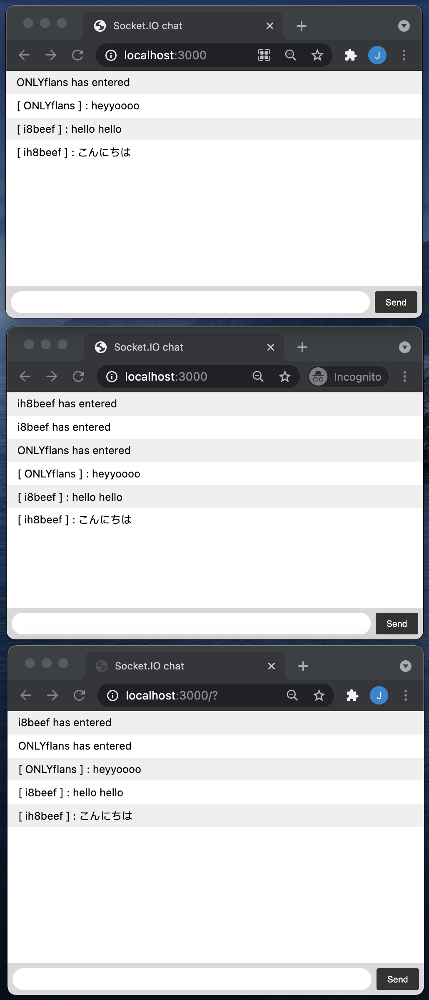

# socketio-chat


<!-- TABLE OF CONTENTS -->
<details open="open">
  <summary>Table of Contents</summary>
  <ol>
    <li>
      <a href="#about-the-project">About The Project</a>
      <ul>
        <li><a href="#built-with">Built With</a></li>
      </ul>
    </li>
    <li>
      <a href="#getting-started">Getting Started</a>
      <ul>
        <li><a href="#installation">Installation</a></li>
      </ul>
    </li>
    <li><a href="#usage">Usage</a></li>
    <li><a href="#roadmap">Roadmap</a></li>
    <li><a href="#contributing">Contributing</a></li>
    <li><a href="#license">License</a></li>
    <li><a href="#contact">Contact</a></li>
  </ol>
</details>


<!-- ABOUT THE PROJECT -->
## About The Project




### Built With
* [NodeJS](https://www.javascript.com/)
* [Socket.IO](https://www.npmjs.com/)


<!-- GETTING STARTED -->
## Getting Started

To get a local copy up and running follow these simple example steps.


### Installation

1. Download or clone this repo 
    ```bash
    $ git clone git@github.com:ellojess/socketio-chat.git
    ```
    
2. `cd` into the project folder and open it in your chosen text editor (or use `code .` to open it in Visual Studio Code
    ```bash
    $ cd socketio-chat

    $ nodemon
    ```
   

<!-- USAGE EXAMPLES -->
## Usage

Simple chat application that tracks users connections and broadcasts messages/


<!-- ROADMAP -->
## Roadmap

See the [open issues](https://github.com/ellojess/socketio-chat/issues) for a list of proposed features (and known issues).


<!-- CONTRIBUTING -->
## Contributing

Contributions are what make the open source community such an amazing place to be learn, inspire, and create. Any contributions you make are **greatly appreciated**.

1. Fork the Project
2. Create your Feature Branch (`git checkout -b feature/AmazingFeature`)
3. Commit your Changes (`git commit -m 'Add some AmazingFeature'`)
4. Push to the Branch (`git push origin feature/AmazingFeature`)
5. Open a Pull Request using this [template](https://github.com/embeddedartistry/templates/blob/master/oss_docs/PULL_REQUEST_TEMPLATE.md)


<!-- LICENSE -->
## License

Distributed under the MIT License. See `LICENSE` for more information.


<!-- CONTACT -->
## Contact

Jessica Trinh - [@ellojesss](https://twitter.com/ellojesss) - jtjessicatrinh@gmail.com

Project Link: [https://github.com/ellojess/socketio-chat](https://github.com/ellojess/socketio-chat)
